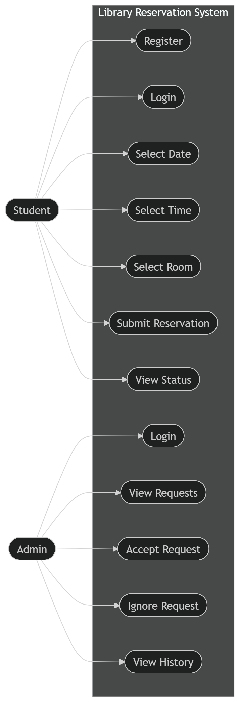
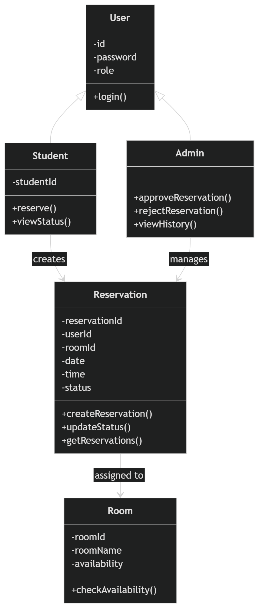

# library-reservation-system
a system for both students and library admins so reservations are easier to manage.

Technology Stack
JavaScript Manages client-side validation, AJAX for real-time room availability, and UI alerts.
CSS Custom styling using the for the Admin and Student dashboards.
PHP Manages client-side validation, AJAX for real-time room availability, and UI alerts.

Student View
Students can either:
Register as a new student
Log in using their Student ID (as username) and password
After logging in, the reservation process is step-by-step:
1.First, select a date
2.Then choose a time
3.Lastly, pick a room/place
we did it this way so two users won’t end up booking the same schedule.

Admin view
Admins can log in and access the dashboard.
From there they can:
Admin Pending Requests
They can also:
See who last used a room (in case there are damages or issues)

## System Diagrams

### Use Case Diagram

### Class Diagram

    

